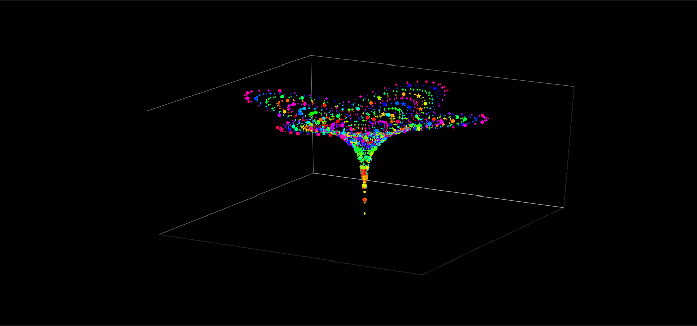

# Introduction 

We have $n=[0,1,2,3,···,N-1]$ as de discrete time index for $S[n]=S_n$:

$$ \theta = e^{\frac{2\pi i}{T_o}}$$

$$\delta[0]=\delta_0 =\frac{1}{T_o}$$

$$\delta[n] =\begin{cases} \delta_0\space for \space n=0\space mod\space T_{mod} \\
                     0\space for \space n > 0 \space mod\space T_{mod} \\
       \end{cases}$$

$$r[-1]=0$$

$$r[n] = r[n-1] + \delta[n] $$

$$\hat n[n] =r[n]·\theta^{n}$$

We could define $M$ as, to group-3-last-symbols: 

$$M=max(S[n],S[n-1],S[n-2])+1$$

Or in a more general situation:

$$M=max(S)+1$$

Consider $S_n$ to be a discretized sample at index n

So we can define our root of unity for representing all possible values of $S$ as:

$$\zeta = e^{\frac{2\pi i}{M}}$$

We could try as base periods for the data to be for example:

$$ T_o = 3 $$

or

$$ T_o = \frac{1}{2} (1+\sqrt{5}) $$

We need a reduction factor to bound the size of the plot at the center of the complex plane
$$K=\frac{1}{\sqrt{2}T_o^2}$$

In the center of the plot we represent the values over time as: 

$$Z[n]=K·log_2(n+2)·\zeta^{S_n}$$

$$\hat \gamma [n]=\gamma^n = \zeta^{S_n}$$ 

And

$$\hat \psi [n] =\psi^n = \hat n[n]+K·\zeta^{S_n}$$

